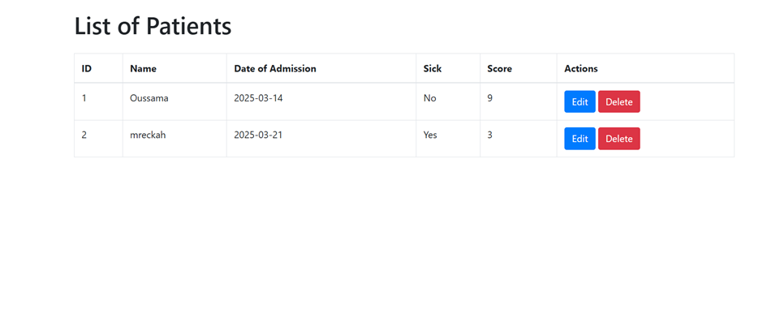
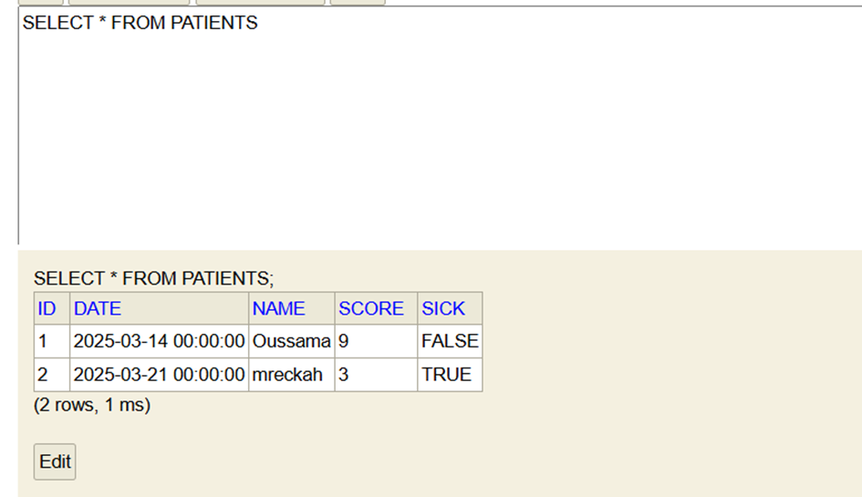
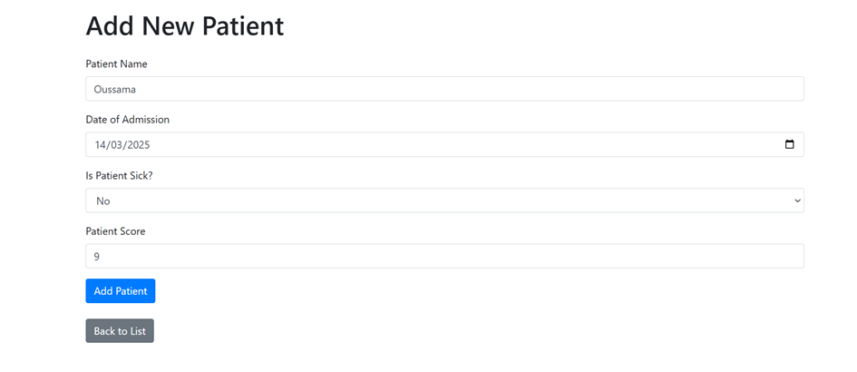

# ThymeCare - Patient Management System

## 📌 Project Overview
ThymeCare is a web-based Java application for managing patient records. Built using **Spring MVC, Thymeleaf, and Spring Data JPA**, it provides functionalities for storing and retrieving patient data efficiently.

## 🚀 Features
-  **List Patients** (with pagination)
-  **Search Patients** by name
-  **Delete Patients**
-  **Add New Patients**
-  **Filter & Sort** patients
-  **Improved UI using Thymeleaf**

## 🛠️ Technologies Used
- **Spring Boot** - Backend Framework
- **Spring MVC** - Web layer
- **Spring Data JPA** - Database integration
- **H2 Database** - In-memory database

---

### **1 Get All Patients (Fetch Data)- Connection with databsase**

### **2 Post A Patients (Store Data)**

### **3 DELETE A Patients (Delete)**

